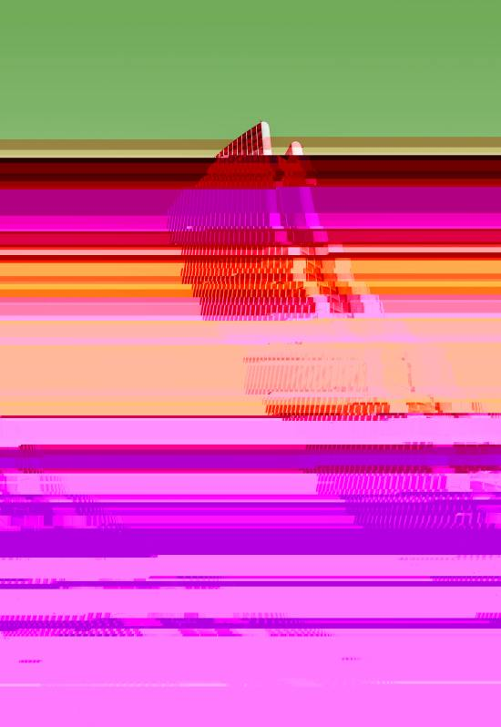

<!-- README.md is generated from README.Rmd. Please edit that file -->

# glitchr

<!-- badges: start -->

[](https://cran.r-project.org/package=glitchr)
<!-- badges: end -->

glitchr is a toy package for databending and creating glitch art in R.
To read more about the idea behind it, take a look at [this blog
post](https://www.petejon.es/posts/2020-03-09-glitch-art-in-r/).

– WORK IN PROGRESS –

## Installation

You can install the development version of glitchr from Github with:

``` r
# install.packages("devtools")
devtools::install_github("pj398/glitchr")
```

## How to use

First, you need to read an image (currently only PNG images are
confirmed to work) as a raw vector in R.

If you have a PNG image on file, you can read this in as raw using
`readr::read_file_raw("path/to_file")`. Alternatively, use one of the
demo images included in the package:

``` r
library(glitchr)
```

``` r
data("demo_img1")
```

This is the raw vector for [the following
image](https://unsplash.com/photos/yQILyG_fGuE):


``` r
class(demo_img1)
#> [1] "raw"
```

This raw data is what we will databend:

``` r
demo_img1[1:100]
#>   [1] ff d8 ff e0 00 10 4a 46 49 46 00 01 01 01 00 48 00 48 00 00 ff e2 02 1c 49
#>  [26] 43 43 5f 50 52 4f 46 49 4c 45 00 01 01 00 00 02 0c 6c 63 6d 73 02 10 00 00
#>  [51] 6d 6e 74 72 52 47 42 20 58 59 5a 20 07 dc 00 01 00 19 00 03 00 29 00 39 61
#>  [76] 63 73 70 41 50 50 4c 00 00 00 00 00 00 00 00 00 00 00 00 00 00 00 00 00 00
```

Now, we can glitch this data using the `glitch_png` function. We need to
choose between two methods for glitching. One (`method = "far"`) uses a
find-and-replace approach which randomly picks unique values from the
raw vector and replaces them with another randomly selected unique
value. The other (`method = "chops"`) randomly selects change points in
the raw vector and then performs chance operations (either adding,
moving, cloning or deleting values) at each change point.

For each method, we can use the `n_changes` argument to specify how many
changes to make. The find-and-replace method can be fine-tuned using
`tune` by specifying what percentage of the found values should be
replaced. The chance operations method can be fine-tuned by using the
`noise` argument to set a ceiling for how much data is modified at each
operation.

Although the `"chops"` method is more fun in terms of what’s happening
under the hood, it is a little unstable so the safest method to use is
generally `"far"`.

Here’s an example:

``` r
my_glitch <- glitch_png(demo_img1, method = "far", n_changes = 3, tune = 5)
```

We can take a look at what we just did using `glitchr::plot_vector`
which uses the excellent
[magick](https://cran.r-project.org/web/packages/magick/vignettes/intro.html)
package to read the databent vector as an image once again so that we
can print it in R.

``` r
my_glitch %>% plot_vector(width_px = 500)
```

If using RStudio, this will open the image in the built-in Viewer.

With a little luck, you will see a glitchy version of your original
image:



Check out the package documentation for more explanation of how to use
the functions.
